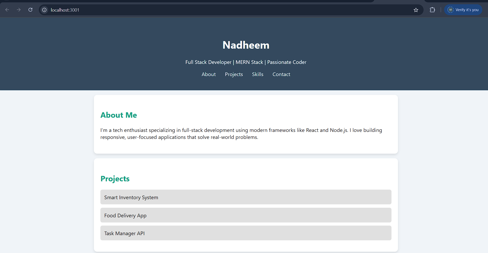

EX.NO: 01
DATE: 
STATIC WEBSITE HOSTING USING NODE.JS WITHOUT EXPRESS
AIM:
To design and develop a modern personal portfolio website with professional content, styled layout, and smooth interaction using HTML, CSS, and JavaScript. The site is hosted using a basic NodeJS static server (without using Express).
ALGORITHM:
STEP 1: Start the Process.
STEP 2: Create a folder “pro1”  with the following files: index.html, style.css, script.js, server.js.
STEP 3: Design a modern layout using HTML for structure and CSS for styling.
STEP 4: Add interactive elements with JavaScript such as modals for project descriptions.
STEP 5: In `server.js`, use Node's core modules (http, fs, path) to create a server that serves static files.
STEP 6: Define MIME types and use fs.readFile() to serve content.
STEP 7: Run the server using node server.js and open http://localhost:3000.
STEP 8: Test all sections like About, Skills, Projects, Contact, etc.
STEP 9: Stop the server with Ctrl+C after testing.
DESIGN:
 

PRO1
•	Root directory of the project.
index.html
•	Main HTML file (homepage).
•	Loaded by default when the user accesses the website.
style.css
•	CSS file used to style the index.html page.
•	Controls layout, colors, fonts, etc.
server.js
•	Main Node.js server script.
•	Responsible for creating the server and serving static files from the public/ folder.
•	Typically uses http module or express for easier handling.

CODING:
index.html:
<!DOCTYPE html>
<html lang="en">
<head>
  <meta charset="UTF-8">
  <title>Nadheem | Full Stack Developer</title>
  <link rel="stylesheet" href="style.css" />
</head>
<body>
  <header>
    <h1>Nadheem</h1>
    
Full Stack Developer | MERN Stack | Passionate Coder

    <nav>
      <a href="#about">About</a>
      <a href="#projects">Projects</a>
      <a href="#skills">Skills</a>
      <a href="#contact">Contact</a>
    </nav>
  </header>

  <section id="about">
    <h2>About Me</h2>
    
I'm a tech enthusiast specializing in full-stack development using modern frameworks like React and Node.js. I love building responsive, user-focused applications that solve real-world problems.

  </section>

  <section id="projects">
    <h2>Projects</h2>
    
Smart Inventory System

    
Food Delivery App

    
Task Manager API

  </section>

  <section id="skills">
    <h2>Technical Skills</h2>
    <ul>
      <li>Frontend: HTML, CSS, JavaScript, React</li>
      <li>Backend: Node.js, Express, MongoDB</li>
      <li>Tools: Git, Postman, VS Code, Docker (Basic)</li>
    </ul>
  </section>

  <section id="contact">
    <h2>Contact Me</h2>
    
Email: <a href="mailto:nadheem.dev@gmail.com">nadheem.dev@gmail.com</a>

    
GitHub: <a href="https://github.com/nadheemdev">github.com/nadheemdev</a>

    
LinkedIn: <a href="https://linkedin.com/in/nadheem">linkedin.com/in/nadheem</a>

  </section>

  <!-- Modal -->
  

    

      &times;
      <h3 id="modal-title"></h3>
      

    

  

  
</body>
</html>

style.css:
body {
    font-family: 'Segoe UI', sans-serif;
    margin: 0;
    padding: 0;
    background: #f9f9f9;
    color: #333;
  }
  header {
    background: #2c3e50;
    color: #fff;
    text-align: center;
    padding: 30px 0;
  }
  nav a {
    margin: 0 15px;
    color: #fff;
    text-decoration: none;
  }
   section {
    padding: 30px 20px;
    margin: 10px auto;
    max-width: 900px;
    background: #fff;
    border-radius: 8px;
    box-shadow: 0 4px 6px rgba(0,0,0,0.1);
  }
  h2 {
    color: #2980b9;
  }
  ul {
    padding-left: 20px;
  }
  .project {
    background: #ecf0f1;
    padding: 10px;
    margin: 10px 0;
    border-radius: 6px;
    cursor: pointer;
    transition: background 0.3s;
  }
  .project:hover {
    background: #d0d0d0;
  }
  /* Modal Styling */
  .modal {
    display: none;
    position: fixed;
    top: 0; left: 0;
    width: 100%; height: 100%;
    background: rgba(0,0,0,0.5);
  }
  .modal-content {
    background: #fff;
    padding: 20px;
    margin: 100px auto;
    width: 90%;
    max-width: 500px;
    position: relative;
    border-radius: 8px;
  }
  .close {
    position: absolute;
    right: 15px;
    top: 10px;
    font-size: 22px;
    cursor: pointer;
  }
script.js:
function showProject(title, description) {
  document.getElementById("modal-title").innerText = title;
  document.getElementById("modal-description").innerText = description;
  document.getElementById("modal").style.display = "block";
}

document.querySelector(".close").onclick = function () {
  document.getElementById("modal").style.display = "none";
};
server.js:
const http = require("http");
const fs = require("fs");
const path = require("path");

http
  .createServer((req, res) => {
    let filePath = "." + req.url;
    if (filePath === "./") filePath = "./index.html";

    const extname = path.extname(filePath).toLowerCase();
    const mimeTypes = {
      ".html": "text/html",
      ".css": "text/css",
      ".js": "application/javascript",
    };

    const contentType = mimeTypes[extname] || "application/octet-stream";

    fs.readFile(filePath, (err, content) => {
      if (err) {
        if (err.code === "ENOENT") {
          res.writeHead(404, { "Content-Type": "text/html" });
          res.end("<h1>404 - File Not Found</h1>");
        } else {
          res.writeHead(500);
          res.end("Server error: " + err.code);
        }
      } else {
        res.writeHead(200, { "Content-Type": contentType });
        res.end(content, "utf-8");
      }
    });
  })
  .listen(3000);

console.log("Portfolio running at http://localhost:3000");

OUTPUT:
 

RESULT:
Thus, the modern portfolio website was successfully created using HTML, CSS, and JavaScript, and hosted using a basic Node.js server without Express.
