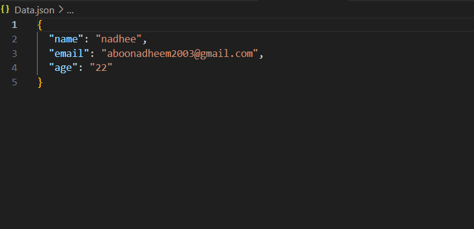
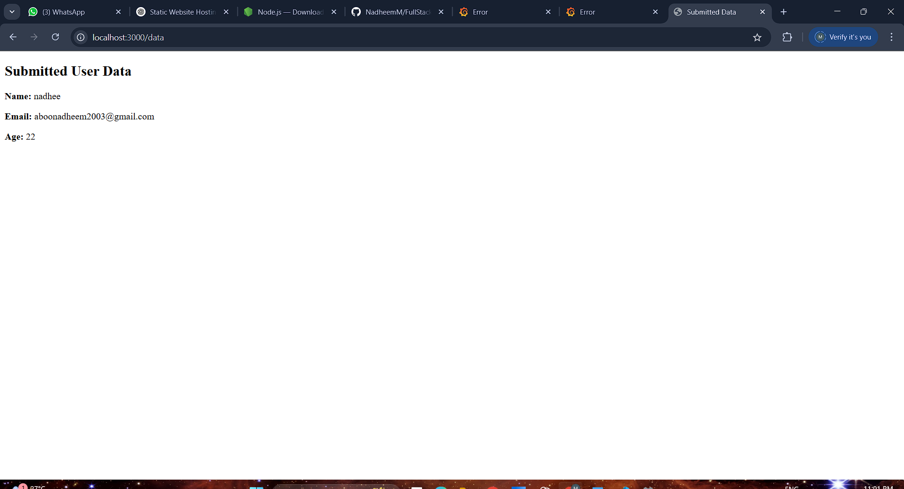

EX.NO: 02
DATE: 
STORING FORM DATA IN JSON AND RENDERING WITH EXPRESS & HANDLEBARS
AIM:
To create a NodeJS server using Express that stores data from a form as a JSON file and displays it in another page. The redirect page should be prepared using Handlebars.
ALGORITHM:
STEP 1: Start the process.
STEP 2: Create a project folder and add views (for .hbs files) and public (optional for static files).
STEP 3: Inside views, create form.hbs for the input form and data.hbs to display submitted data.
STEP 4: In the root folder, create server.js with Express logic, routing, and view rendering.
STEP 5: Create an empty data.json file with {} to store submitted data.
STEP 6: Run npm init -y in the terminal to initialize the Node.js project.
STEP 7: Install dependencies using npm install express body-parser hbs.
STEP 8: Set up middleware, view engine, and routes for /, /submit, and /data in server.js.
STEP 9: Run the server using node app.js and open http://localhost:3000 in a browser.
STEP 10: Fill and submit the form, view saved data on /data, and stop the server when done.
DESIGN:

FormDataProject/
├── views/
│   ├── form.hbs
│   └── data.hbs
├── data.json
├── app.js
├── package.json

CODING:
form.hbs:
<!DOCTYPE html>
<html>
<head>
  <title>User Form</title>
</head>
<body>
  <h2>Enter Your Details</h2>
  <form action="/submit" method="POST">
    <label>Name:</label>
    <input type="text" name="name" required>  

    <label>Email:</label>
    <input type="email" name="email" required>  

    <label>Age:</label>
    <input type="number" name="age" required>  

    <button type="submit">Submit</button>
  </form>
</body>
</html>

Data.hsb:
<!DOCTYPE html>
<html>
<head>
  <title>Submitted Data</title>
</head>
<body>
  <h2>Submitted User Data</h2>
  
<strong>Name:</strong> {{user.name}}

  
<strong>Email:</strong> {{user.email}}

  
<strong>Age:</strong> {{user.age}}

</body>
</html>
App.js:
const express = require("express");
const bodyParser = require("body-parser");
const fs = require("fs");
const path = require("path");

const app = express();
const PORT = 3000;

// Set view engine and views folder
app.set("view engine", "hbs");
app.set("views", path.join(__dirname, "views"));

// Middleware
app.use(bodyParser.urlencoded({ extended: true }));
app.use(express.static("public"));

// Home route - show form
app.get("/", (req, res) => {
  res.render("form");
});

// POST route - save form data
app.post("/submit", (req, res) => {
  const userData = req.body;
  fs.writeFile("data.json", JSON.stringify(userData, null, 2), (err) => {
    if (err) return res.status(500).send("Error saving data");
    res.redirect("/data");
  });
});

// GET route - display saved data
app.get("/data", (req, res) => {
  fs.readFile("data.json", "utf8", (err, jsonData) => {
    if (err) return res.status(500).send("Error reading data");
    const parsedData = JSON.parse(jsonData);
    res.render("data", { user: parsedData });
  });
});

// Start server
app.listen(PORT, () => {
  console.log(`Server is running on http://localhost:${PORT}`);
});
:
{}

OUTPUT:
 
 
 

 

RESULT:
Thus, the form data was successfully stored in a JSON file and displayed using Handlebars in another page using NodeJS and Express
